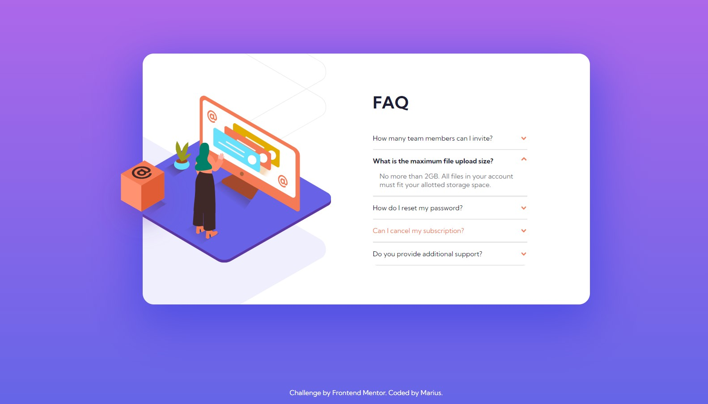

# Frontend Mentor - FAQ accordion card solution

This is a solution to the [FAQ accordion card challenge on Frontend Mentor](https://www.frontendmentor.io/challenges/faq-accordion-card-XlyjD0Oam). Frontend Mentor challenges help you improve your coding skills by building realistic projects.

## Table of contents

- [Overview](#overview)
  - [The challenge](#the-challenge)
  - [Screenshot](#screenshot)
  - [Links](#links)
  - [Built with](#built-with)
- [Author](#author)

## Overview

### The challenge

Users should be able to:

- View the optimal layout for the component depending on their device's screen size
- See hover states for all interactive elements on the page
- Hide/Show the answer to a question when the question is clicked

### Screenshot

### Links

- Solution: [GitHub](https://github.com/MariusDevelops/faq-accordion-card)
- Live: [FAQ accordion card](https://mariusdevelops.github.io/faq-accordion-card/)

### Built with

- [React](https://reactjs.org/) - JS library
- [Sass](https://sass-lang.com/) - Syntactically Awesome Style Sheets

## Author

- Website - [Marius Bražas](https://mariusdevelops.github.io/)
